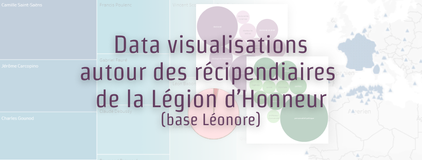

# À propos

Ce projet a été réalisé par [Axelle lecroq](https://github.com/axellelecroq) et [Léa Perissier](https://github.com/leaprs) dans le cadre du cours _Données, Web de données et exploitation_ au sein du master 2 TNAH de l'École nationale des chartes. 
Il consiste en la réalisation d'une analyse prosopographique des récipiendaires de la Légion d'honneur via des visualisation de données. Pour davantage de renseignements sur les contraintes de ce projet, veuillez vous référer au fichier concernant [les consignes](https://github.com/axellelecroq/leonore-dataviz/blob/main/consignes.md).
Le traitement des données a été réalisé grâce au logiciel _Dataiku_ et les visualisations sur _Tableau Public_. Un compte rendu détaillé des étapes de notre travail est diponible à travers notre [feuille de route](https://github.com/axellelecroq/leonore-dataviz/blob/main/feuille_de_route.md).

# Structure du dépôt

```shell
leonore-dataviz
    ├── data_bnf/...                                # données récupérées via Data Bnf
    ├── data_dataiku/...                            # jeu de données finaux générés grâce à Dataiku
    ├── data_wikidata/...                           # données récupérées via Wikidata
    ├── dataviz/...                                 # visualisations
    ├── documentation/...                           
    ├── pour_dataviz                                # données spécialement conçues pour les visualisations
    │      ├── diplome_leonoreid.csv
    │      ├── metier_leonoreid.csv
    │      └── qrtsiecle_leonore.csv
    ├── script                                      # script python pour les analyses par quart de siècle
    │      ├── data_leonore.json
    │      ├── naissance_par_an.json
    │      ├── naissance_par_qrtdesiecle.json
    │      └── script.py
    ├── sparql                                      # requêtes pour récupérer les jeu de données
    │      ├── lot_URIbnf.csv
    │      ├── lot_villes.csv
    │      ├── requete_bnf.md
    │      └── requete_wikidata.md
    ├── consignes.md
    ├── feuille_de_route.md
    └── metadonnes_leonore.zip                      # jeu de données initial des Archives Nationales
```

# Visualisations

Les différents tableaux de bord résultant du traitement des données des récipiendaires :

- [Tableau de bord général sur les récipiendaires](https://public.tableau.com/app/profile/lecroq/viz/Lonore_16220448187940/Gnrales)
- [Tableau de bord sur les données des récipiendaires récupérées via Wikidata](https://public.tableau.com/app/profile/lecroq/viz/Lonore_16220448187940/Wikidata)
- [Tableau de bord sur la bibliographie des récipiendaires récupérée via Data BnF](https://public.tableau.com/app/profile/lecroq/viz/Lonore_16220448187940/Bibliographie)
