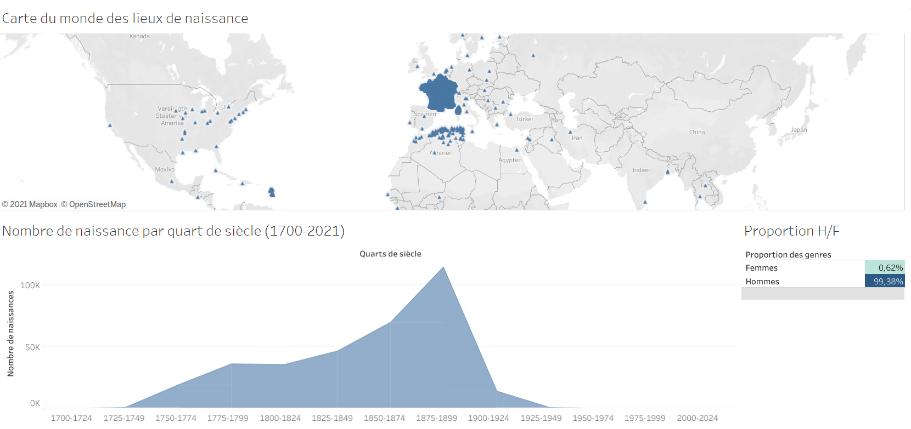
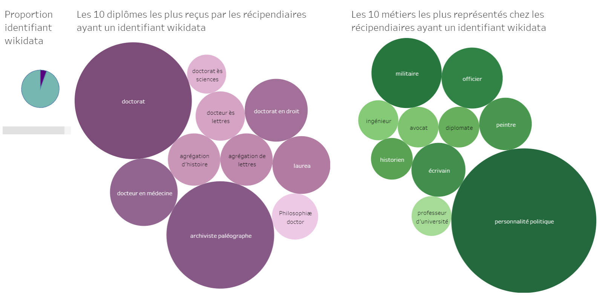
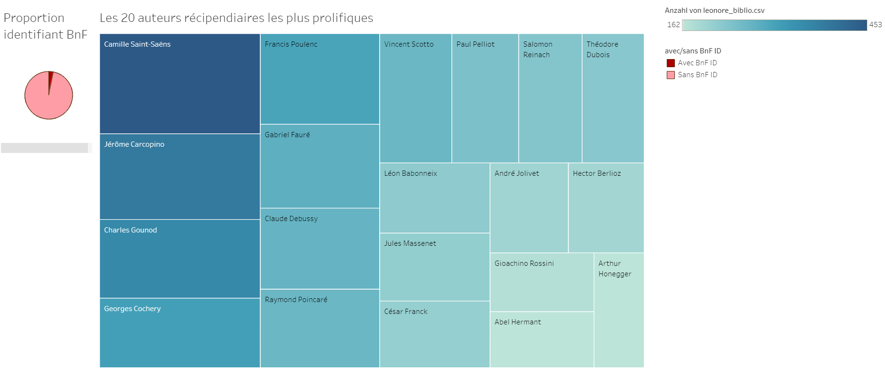

# Mashup de données à partir de la base Léonore
# Liste des étapes de réalisation

## Récupération et nettoyage du jeu de données de la base Léonore des Archives Nationales

Le jeu de données de la base Léonore des AN se situe à la base de notre projet, et a été constamment enrichi par d’autres jeux de données. Dans cette explication nous l’appelerons jeu de données de base ou initial.

Les étapes de préparation de ce jeu de données sont les suivantes : 
- suppression des colonnes avec peu d’informations ou des informations non pertinentes en vue des futures visualisations
- concaténation des colonnes “COTE” et “DOSSIER” afin de permettre la création des identifiants Léonore
- harmonisation du nommage des colonnes, normalisation des dates sous le format YYYY-MM-DD grâce à une formule 
- division de la colonne concernant les lieux de naissance.

Cette dernière étape a été celle qui posa le plus de réflexion sur les informations qu’elle transmettait.En effet, plusieurs cas de figures coexistaient : "Pays ; ville ; quartier", "Département ; ville ; quartier" et enfin, "Ville" dans le cas de Paris, par exemple.
Il a été choisi de séparer cette colonne en ne gardant que la deuxième valeur, à savoir la ville. Pour la ville de Paris, il a été choisi de rajouter avant la valeur "France ;" afin de placer Paris en deuxième valeur et ainsi, permettre une séparation des colonnes sur le premier point-virgule pour garder en deuxième valeur que les villes. De plus, il a été choisi de conserver les premières valeurs dans une autre colonne en dépit de l’hétérogénéité des valeurs de cette colonne, désignant tantôt le pays, tantôt le département. Cette colonne intitulée "dpt/paysNaissance" a été utile lors des jointures avec les autres fichiers concernant des coordonnées géographiques, limitant ainsi les homonymes par des correspondances sur une autre valeur que la ville elle-même.

## Enrichissement des données via Wikidata

Au jeu de données initial ont été ajoutés plusieurs jeux de données récupérés grâce à des requêtes SPARQL sur Wikidata, à savoir : 
- les identifiants Wikidata des récipiendaires
- les métiers et les diplômes des récipiendaires bénéficiant d’un identifiant Wikidata
- les images des récipiendaires bénéficiant d’un identifiant Wikidata
- les dates, les lieux et coordonnées géographiques de naissance des récipiendaires bénéficiant d’un identifiant Wikidata

Les fichiers csv obtenus par ces requêtes ont été préparés dans Dataiku et joints à notre jeu de données initial.

## Construction des URIs BnF et requête via Data BnF pour obtenir les oeuvres des récipiendaires

Afin de récupérer les œuvres des récipiendaires via Data BnF, les identifiants BnF de ces derniers ont d’abord été récupérés grâce à Wikidata. Puis, les URIs correspondants aux identifiants BnF ont été construits grâce à une recette dans Dataiku. Ainsi obtenus, ils ont été renseignés en tant que VALUES de plusieurs requêtes via le SPARQL Endpoint de Data BnF permettant de récupérer les œuvres correspondantes à chaque récipendiaire ayant un ou des identifiants BnF.

De cette manière, les œuvres des récipiendaires ont été apportées dans un fichier csv. Nous avons choisi volontairement de structurer notre fichier sous le format une ligne = une œuvre d’un récipiendaire. 
En effet, le fait de sauvegarder les doublons sur les identifiants Léonore et les noms permettra leur calcul pour une visualisation qui présentera les auteurs les plus prolifiques.

## Enrichissement des données de géolocalisation grâce à Wikidata

Cet enrichissement des données géographiques a été décidée suite à un constat : les lacunes des données. Suite à une requête SPARQL sur Wikidata, nous avons récupéré les géolocalisation des lieux de naissances de récipendiaires représentés sur Wikidata. En effet, un pourcentage marginal des récipiendaires bénéficient d’un identifiant Wikidata et les coordonnées de naissance ainsi rapportées étaient trop faibles pour envisager une visualisation pertinente des lieux de naissance. Grâce à cette première requête, seuls 4% des récipendaires possédaient une géolocalisation pour son lieu de naissance. 

Ainsi, nous avons procédé à différentes requêtes afin de rapporter un maximum de données géographiques. Nous avons tout d’abord récupéré toutes les communes de France puis les capitales du monde et les villes de certains pays qui nous semblaient apparaître de manière récurrente dans le set de données des Archives Nationales, à savoir : les États-Unis, Vietnam, Inde, Maroc, Algérie, Tunisie.

Ces données rapportées ont ensuite été traitées dans Dataiku, notamment pour supprimer les coordonnées invalides et pour supprimer les doublons de coordonnées. Puis, différents empilements (_stack_) de ces données ont été effectués afin de permettre une jointure avec notre fichier initial. Cette dernière a porté sur les colonnes “villeNaissance” et “dpt/PaysNaissance” déjà existantes dans notre jeu de donnée original. Cet enrichissement a permis de passer de 4% de coordonnées géographiques sur les lieux de naissance à environ 80%.

## Création des visualisations grâce au logiciel Tableau

Nos tableaux de bord finaux se composent de plusieurs visualisations de différents types. Certaines d’entre elles ont été réalisées à partir de fichiers spécialement conçus pour les visualisations ; ils seront transmis avec le projet dans un dossier spécifique.

Tout d’abord, trois visualisations effectuées à partir de notre jeu de donnée initial enrichi disponible en cliquant sur
[ce lien](https://public.tableau.com/app/profile/lecroq/viz/Lonore_16220448187940/Gnrales).
- La première est une carte du monde présentant les lieux de naissances des récipiendaires enrichis de leur géolocalisation. Lorsque l’on se déplace sur la carte, une infobulle apparaît avec le nom de la ville ciblée et le nombre de personnes nées dans cette dernière. 
- La seconde visualisation témoigne de la proportion d’hommes et de femmes parmi les récipiendaires (les valeurs nulles, minoritaires, ont été exclues). 
- Enfin, une visualisation portant sur les dates de naissance des récipiendaires par quart de siècle. Pour cette dernière, un script python rédigé et utilisé en amont afin de préparer un fichier csv comptabilisant  le total de date de naissance par quart de siècle. Lefichier csv découlant de ce script a été joint à notre fichier initial dans Tableau. Cette visualisation est intéressante à exploiter afin de pouvoir plus jauger vers quelle période historique la Légion d’honneur a été le plus attribuée. Étant donné que les données sur l’année de réception de la Légion d’honneur sont malheureusement manquantes, cette visualisation permet d’apporter plus de précision dans ce sens. Le pic des dates de naissance recensées à la fin du XIXe siècle montre que davantage de Légions d’honneur ont été attribuées au cours de la première moitié du XXe siècle.

Nous regrettons le manque de données concernant l’année de réception de la Légion d’honneur. En effet, une visualisation sur ces données aurait pu véritablement enrichir notre travail. Ces données n’étaient ni disponibles dans le jeu de données des Archives Nationales, ni sur Wikidata.

Ensuite, trois autres visualisations concernent les données récupérées grâce à Wikidata visible sur [ce tableau de bord](dataviz/wikidata.png). 
- La première représente la proportion de récipiendaires bénéficiant d’un identifiant Wikidata afin d’informer le lecteur  de la représentativité des visualisations à partir des données de Wikidata.
- La seconde représente les dix professions les plus exercées par les récipiendaires ayant un identifiant Wikidata. 
- La dernière représente les dix diplômes les plus obtenus parmi les récipien daires ayant un identifiant Wikidata. 

Pour ces deux dernières visualisations, du fait de l’impossibilité d’utiliser notre jeu de données initial à cause des concaténations de valeurs pour les diplômes et professions, deux fichiers ont été spécialement élaborés à l’aide de deux nouvelles requêtes qui, en conservant les doublons, ont permis le dénombrement des professions et métiers. Ces deux fichiers ont été joints au jeu de données initial à l’intérieur de Tableau Public.

Enfin, les deux dernières visualisations s’intéressent à la bibliographie des récipiendaires obtenue via une requête sur Data BnF. 
Ces visualisations sont disponibles en cliquant sur [ce lien](https://public.tableau.com/app/profile/lecroq/viz/Lonore_16220448187940/Bibliographie).
- La première visualisation représente la proportion des récipiendaires bénéficiant d’un identifiant BnF et donc d’une bibliographie. Cette dernière permet d’informer le lecteur du pourcentage d’auteurs parmi le total des récipiendaires. 
- La seconde visualisation illustre les vingt auteurs récipiendaires les plus prolifiques.

## Composition finale du mashup de données

Notre rendu final est constitué :
- de l’export de notre projet Dataiku
- des liens vers les différents tableaux de bord sur Tableau en ligne
- de nos jeu de données finaux (jeu de donnée initial enrichi sur les récipiendaires et bibliographie)
- des fichiers et du script python ayant été utilisés uniquement pour les visualisations
